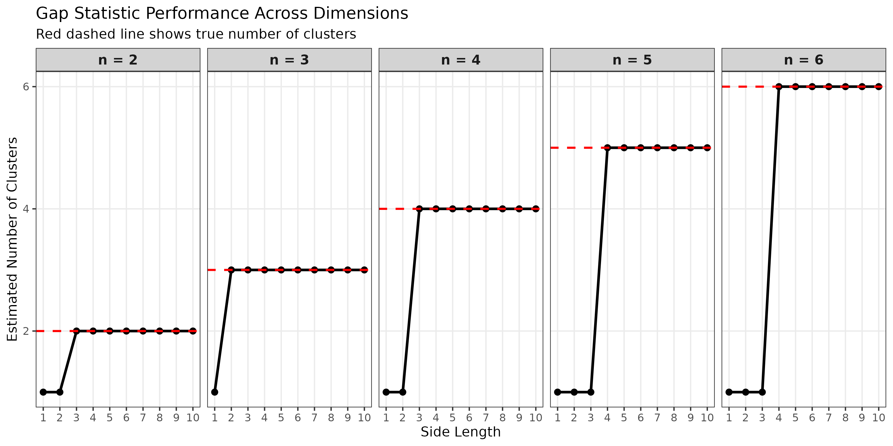
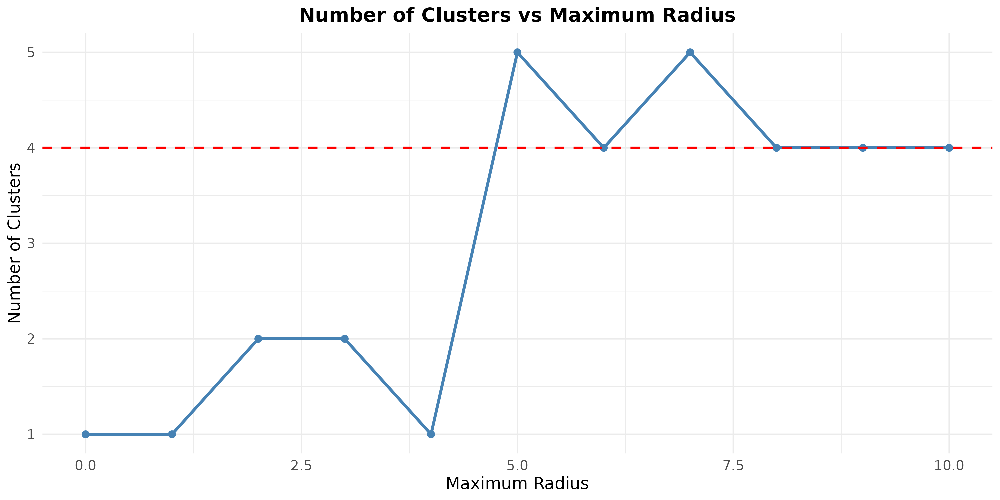

```{r setup, include=FALSE}
knitr::opts_chunk$set(echo = TRUE)
```

# Task 1

The gap statistics method consistently begins to reduce its estimate of number of clusters at around side length 3-1. The first drop in number of clusters happens at side length 3 for n=5 and n=6; n=4 clusters drop at n=2; and at n=1 we have the number of clusters drop at n=1.  

{width=80%}

# Task 2 

### Plotly Plot 

Below is our plotly plot of 2020 data points. The generate_shell_clusters has been modified so that so that for each shell we generate $r^2$ more data points where $r$ varies for each shell radius.

```{r , fig.cap="", echo=FALSE, results='show', message=FALSE, fig.height=4, fig.width=6, warning=FALSE, fig.align="center"}
library(plotly)
source("task2/task2_helpers.R")

# Generate sample dataset
set.seed(42)
n_shells <- 5
k_per_shell <- 10
max_radius <- 10

result <- generate_shell_clusters(n_shells, k_per_shell, max_radius, noise_sd = 0.1)
X <- result$X
labels <- result$labels
# Create interactive 3D scatter plot
fig <- plot_ly(
  x = X[, "X"],
  y = X[, "Y"],
  z = X[, "Z"],
  type = "scatter3d",
  mode = "markers",
  color = as.factor(labels),
  marker = list(
    size = 3,
    opacity = 0.8
  ),
  text = paste("Shell", labels),
hovertemplate = paste(
    "<b>Shell %{text}</b><br>",
    "x: %{x:.2f}<br>",
    "y: %{y:.2f}<br>",
    "z: %{z:.2f}",
    "<extra></extra>"
  )
) %>%
  plotly::layout(
    title = paste(n_shells, "Concentric Shells with", k_per_shell, "Points Each"),
    scene = list(
      xaxis = list(title = "X"),
      yaxis = list(title = "Y"),
      zaxis = list(title = "Z"),
      aspectmode = "data"
    )
  )
fig
```

### Plot of Optimal Cluster Count as Function of Maximum Shell Radius

Using our modified generate_shell_clusters function, we have reasonable clustering results. We have a reference line in red below for the true number of clusters. The reasoning behind the failure point is the sensitivity of the sparsification threshold that is being selected, $\tau_d=1$. 

The idea is that at around a maximum shell radius of $r$ the corresponding euclidean distance and threshold of 1 puts all points within the radius five shell as being "connected" between shells and not just within shells. This causes the spectral embedding space to show that all points are connected as a single conductive manifold (i.e., one cluster).

If we changed the $\tau_d=0.8$ we might get slightly less connectivity in our clusters. It is possible then that the kmeans algorithm will decide to just throw all these less connected graph components into a single cluster as it fails to cluster together several sparse components as a result of a more sparse adjacency rule. However, with respect to the maximum radius, it will be likely that our drop in cluster count may happen at smaller maximum radii because it the threshold may not connect points between smaller shells since the threshold is smaller. 

Alternatively, if we have a bigger threshold, $\tau_d=1.2$, we may get the drop in number of clusters for bigger maximum radii because the more generous and larger threshold will consider shells with greater distance between to be connected to each other. So, we will have a drop in maximum number of clusters for bigger maximum radii.

{width=80%}